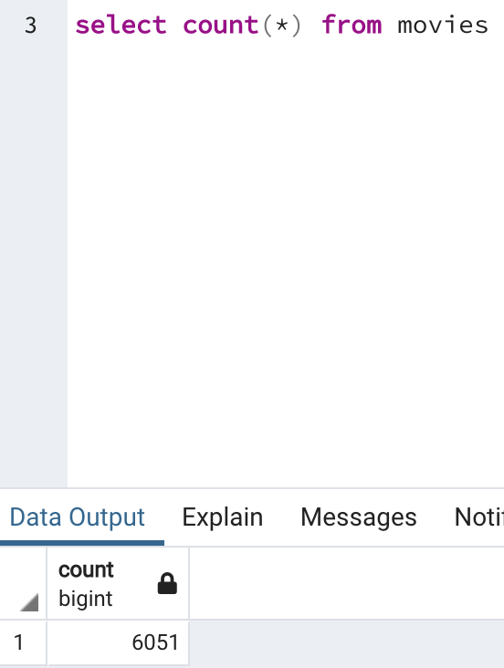
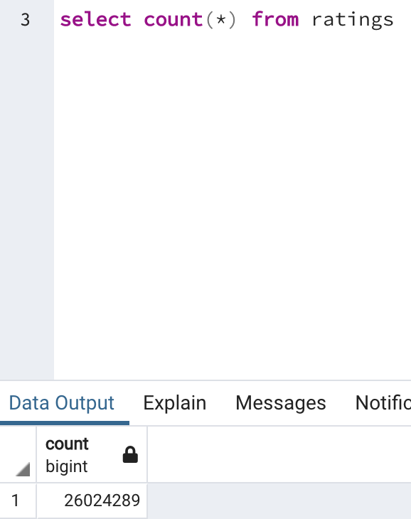

# Movies - ETL Process

## Overview
This project creates an automated pipeline that takes in new data, performs the appropriate transformations and loads the data into existing tables. 

## Results
The ETL_function_test.ipynb file created a function that reads in the three data files (ratings csv, movies csv, wiki movies json) and creates three separate DataFrames. The ETL_clean_wiki_movies.ipynb file extracted and transformed the Wikipedia data to merge it with the Kaggle metadata. When extracting the IMDb IDs using a regular expression string and dropping duplicates, a try-except block was used to catch errors. The ETL_clean_kaggle_data.ipynb file extracted and transformed the Kaggle metadata and MovieLens rating data, then converted the transformed data into separate DataFrames. Then the Kaggle metadata DataFrame was merged with the Wikipedia movies DataFrame to create the movies_df DataFrame. The movies_df DataFrame was then merged with the MovieLens rating data DataFrame to create the movies_with_ratings_df. The ETL_create_database.ipynb file added the movies_df DataFrame and MovieLens rating CSV data to a SQL database. Within the SQL database, queries could be run to answer questions on the data, as seen in the following screenshots.

